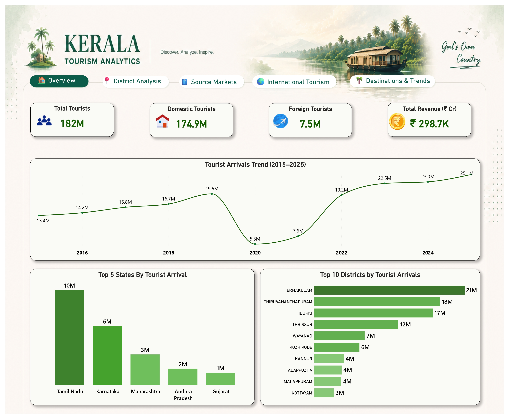
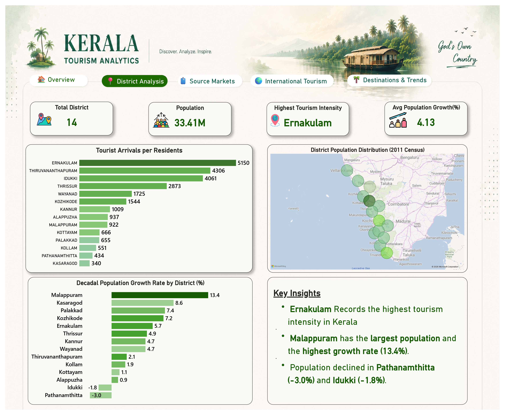
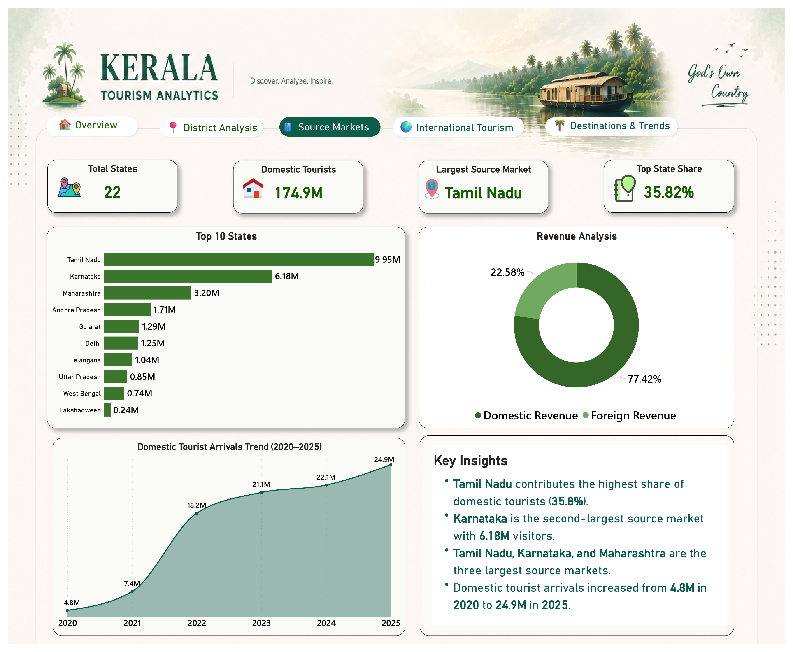
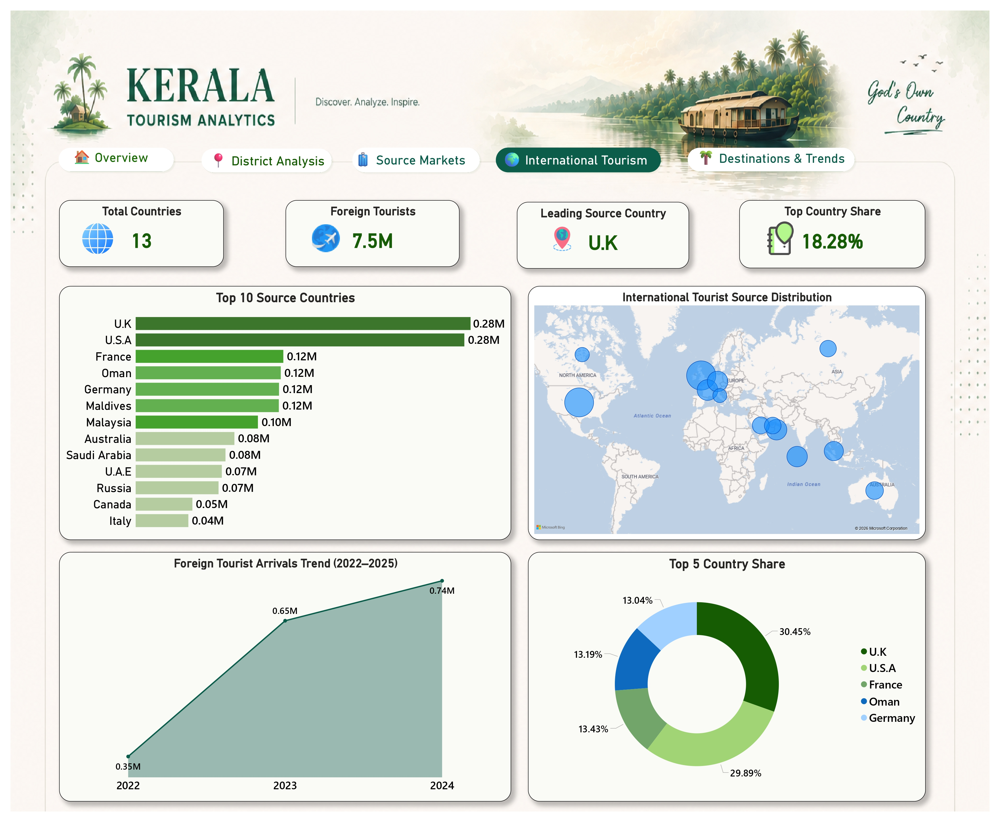
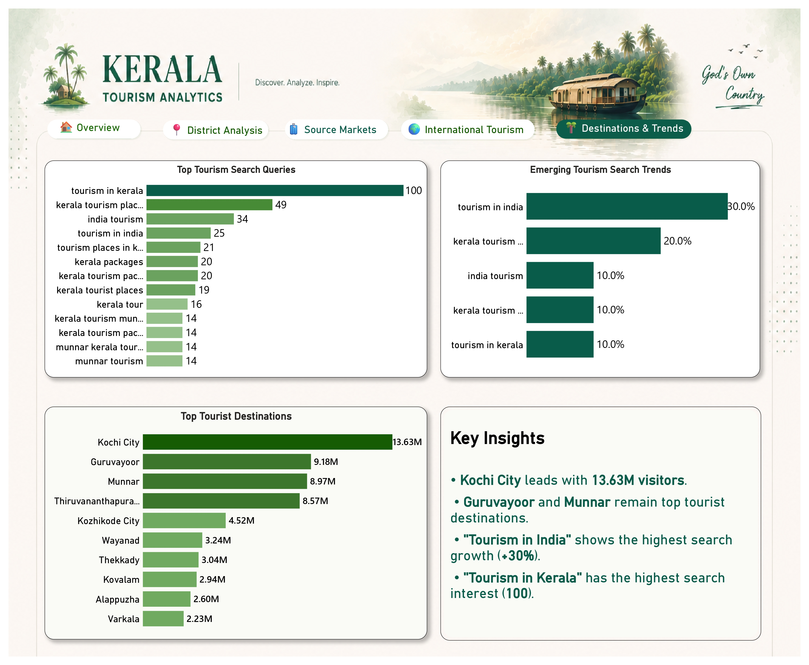

# Kerala Tourism Analytics Dashboard | Excel | SQL | Power Bi

## 📌 Project Overview

Developed an end-to-end **Kerala Tourism Analytics Dashboard** by collecting tourism data from official government sources, cleaning and transforming datasets in Excel, performing exploratory analysis using SQL, and building interactive visualizations in Power BI.

The dashboard provides insights into tourism performance across Kerala, covering visitor trends, district-wise analysis, source markets, international tourism, destination popularity, and tourism search behavior.

---

## 🔄 Project Workflow

**Data Collection → Data Cleaning → SQL Analysis → Power BI Visualization**

---

## 📂 Data Sources

- Kerala Tourism Statistics Portal  
  https://www.keralatourism.org/touriststatistics/

- Kerala Open Data Portal  
  https://www.datahub.kerala.gov.in/

---

## 🛠️ Tools & Technologies

- Microsoft Excel
- SQL
- Power BI
- Power Query
- DAX
- GitHub

---

## 📊 Dashboard Pages

### 1. Overview
- Total Tourist Arrivals
- Foreign Tourist Visits
- Tourism Revenue
- Visitor Trends

### 2. District Analysis
- District-wise Tourist Arrivals
- Geographic Distribution
- Performance Comparison

### 3. Source Markets
- Top Domestic Source States
- State-wise Market Share
- Source Distribution Analysis

### 4. International Tourism
- Top Source Countries
- Country-wise Market Share
- Foreign Tourist Trends

### 5. Destinations & Trends
- Top Tourist Destinations
- Most Searched Tourism Keywords
- Emerging Tourism Search Trends
- Key Insights

---

## 💡 Key Insights

- Kochi City is Kerala's most visited destination.
- Tamil Nadu is the largest domestic source market.
- U.K. is the leading international source country.
- Tourism demand shows strong recovery after pandemic disruptions.
- Search trends indicate growing interest in Kerala tourism and destination-focused travel planning.

---

## 📁 Repository Contents

```text
├── Kerala Tourism Analytics.pbix
├── Kerala Tourism Analytics.pdf
├── Kerala Tourism.sql
├── Dashboard_Images/
└── README.md
```

---

## 📸 Dashboard Preview

### Overview


### District Analysis


### Source Markets


### International Tourism


### Destinations & Trends

---

## 🎯 Skills Demonstrated

- Data Cleaning & Transformation
- SQL Analysis
- Data Modeling
- Power Query
- DAX
- Dashboard Design
- Data Visualization
- Business Intelligence
- Storytelling with Data

---

## 👤 Author

**Sanjay Nambiar**

- LinkedIn: *(Add your LinkedIn profile URL)*
- GitHub: https://github.com/sanjaynbr
